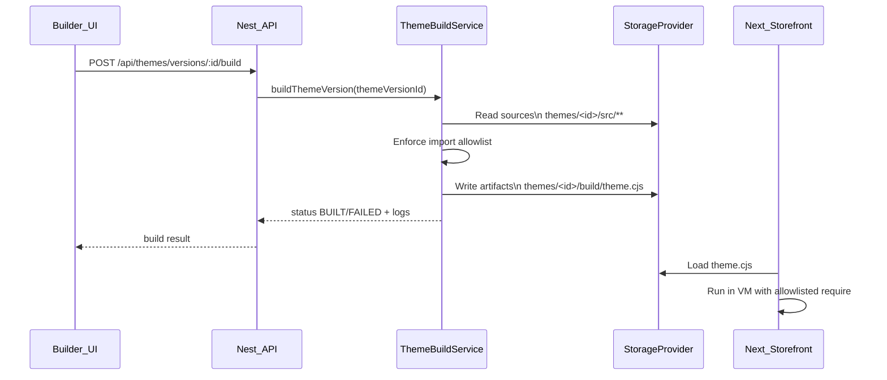

# Diagram: Theme Build Pipeline

```mermaid
sequenceDiagram
  participant Builder as Builder_UI
  participant API as Nest_API
  participant Build as ThemeBuildService
  participant Storage as StorageProvider
  participant Storefront as Next_Storefront

  Builder->>API: POST /api/themes/versions/:id/build
  API->>Build: buildThemeVersion(themeVersionId)
  Build->>Storage: Read sources\n themes/<id>/src/**
  Build->>Build: Enforce import allowlist
  Build->>Storage: Write artifacts\n themes/<id>/build/theme.cjs
  Build-->>API: status BUILT/FAILED + logs
  API-->>Builder: build result
  Storefront->>Storage: Load theme.cjs
  Storefront->>Storefront: Run in VM with allowlisted require
```

