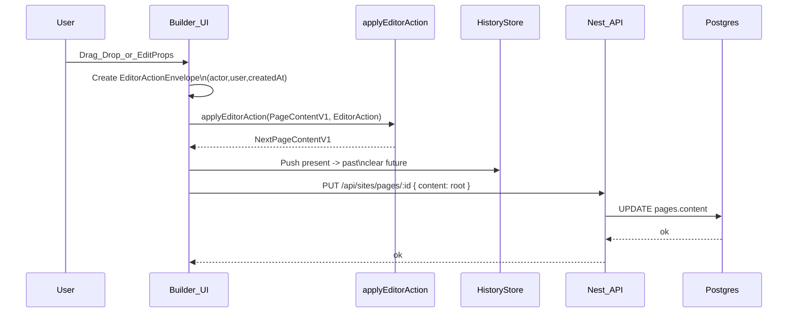

# Diagram: Editor Action Model (AI-ready)

```mermaid
sequenceDiagram
  participant User as User
  participant UI as Builder_UI
  participant Engine as applyEditorAction
  participant History as HistoryStore
  participant API as Nest_API
  participant DB as Postgres

  User->>UI: Drag_Drop_or_EditProps
  UI->>UI: Create EditorActionEnvelope\n(actor,user,createdAt)
  UI->>Engine: applyEditorAction(PageContentV1, EditorAction)
  Engine-->>UI: NextPageContentV1
  UI->>History: Push present -> past\nclear future
  UI->>API: PUT /api/sites/pages/:id { content: root }
  API->>DB: UPDATE pages.content
  DB-->>API: ok
  API-->>UI: ok
```

## Why this matters
An AI agent can produce the **same `EditorAction`** objects instead of directly mutating state.

