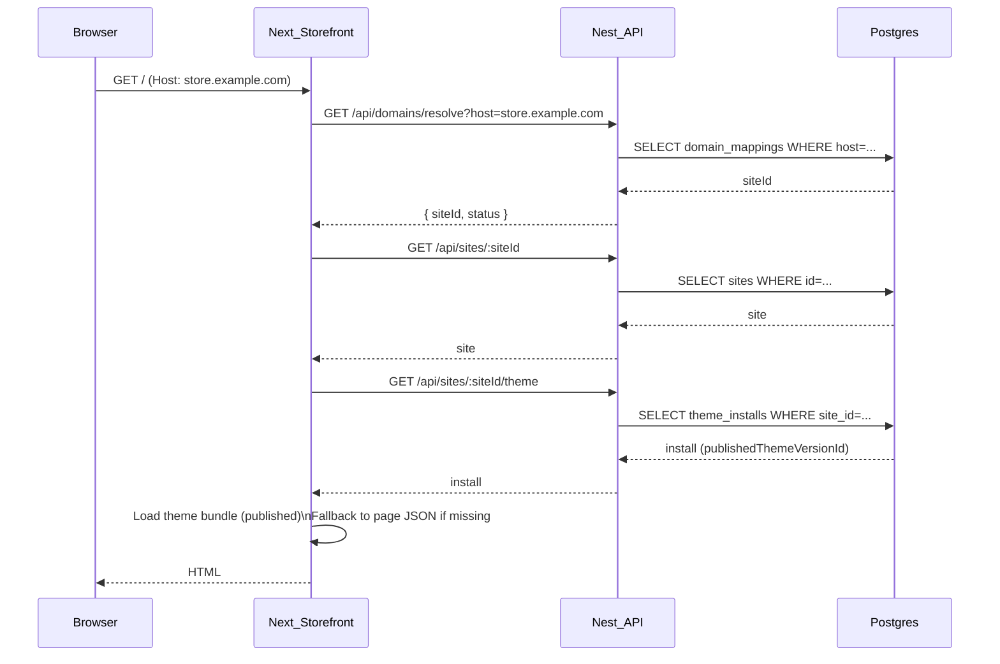

# Diagram: Tenant Resolution

```mermaid
sequenceDiagram
  participant Browser as Browser
  participant Storefront as Next_Storefront
  participant API as Nest_API
  participant DB as Postgres

  Browser->>Storefront: GET / (Host: store.example.com)
  Storefront->>API: GET /api/domains/resolve?host=store.example.com
  API->>DB: SELECT domain_mappings WHERE host=...
  DB-->>API: siteId
  API-->>Storefront: { siteId, status }
  Storefront->>API: GET /api/sites/:siteId
  API->>DB: SELECT sites WHERE id=...
  DB-->>API: site
  API-->>Storefront: site
  Storefront->>API: GET /api/sites/:siteId/theme
  API->>DB: SELECT theme_installs WHERE site_id=...
  DB-->>API: install (publishedThemeVersionId)
  API-->>Storefront: install
  Storefront->>Storefront: Load theme bundle (published)\nFallback to page JSON if missing
  Storefront-->>Browser: HTML
```

