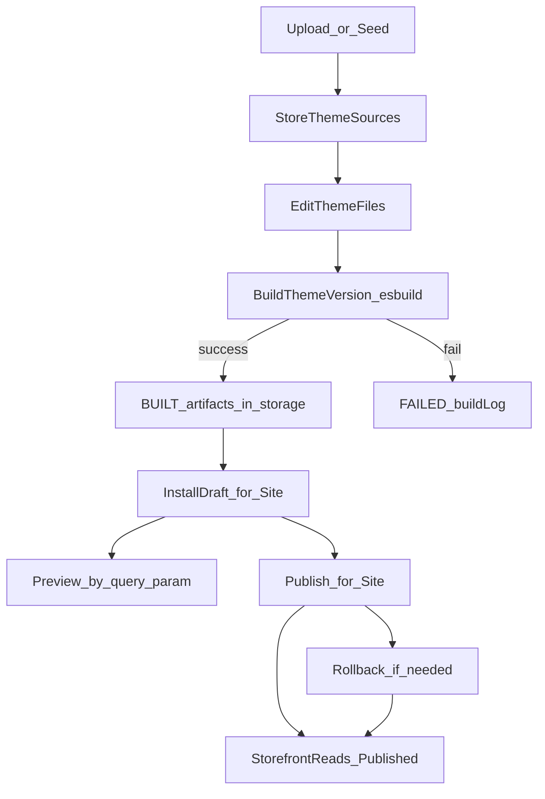

# Diagram: Theme Lifecycle

```mermaid
flowchart TD
  upload[Upload_or_Seed] --> srcStored[StoreThemeSources]
  srcStored --> edit[EditThemeFiles]
  edit --> build[BuildThemeVersion_esbuild]
  build -->|success| built[BUILT_artifacts_in_storage]
  build -->|fail| failed[FAILED_buildLog]
  built --> install[InstallDraft_for_Site]
  install --> preview[Preview_by_query_param]
  install --> publish[Publish_for_Site]
  publish --> storefrontReads[StorefrontReads_Published]
  publish --> rollback[Rollback_if_needed]
  rollback --> storefrontReads
```

