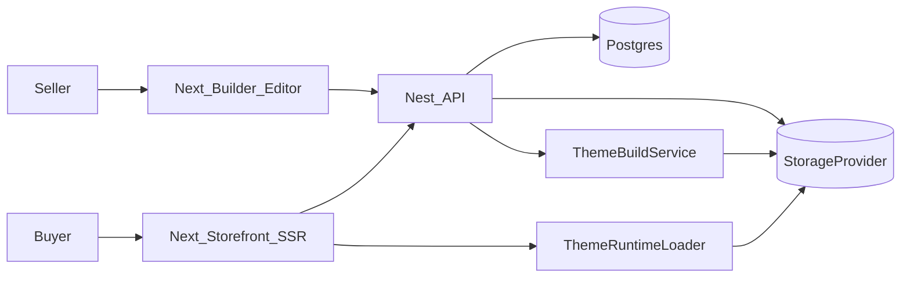

# Architecture Overview

## High-level system

## Core concepts
- **Sites/Pages**: sellers create Sites and Pages; layout JSON is stored in Postgres
- **Themes**: uploaded/seeded bundles stored in Storage; built into runtime artifacts
- **Domains**: map custom `Host` -> `siteId` for multi-tenant storefront routing
- **Editor actions**: every editor change can be represented as a typed command (future AI agent can call the same commands)

