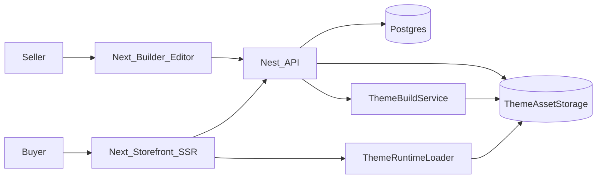
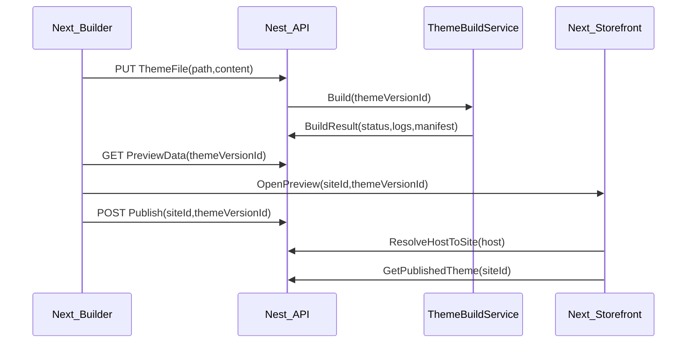

# Enterprise Theme + Storefront Plan

## Goal

Deliver a **Shopify-grade (and beyond) web builder** where sellers:

- Install/manage themes from a **Theme Store**
- **Open/edit theme files** (React-based) in the web editor
- See **live preview**, then **publish** to their **custom domains**
- Storefront renders **SSR multi-tenant** by domain

## Architecture (high-level)

## Key Design Decisions (locked in)

- **Storefront**: SSR multi-tenant Next.js, routing by `Host` header.
- **Themes**: Uploaded bundles (zip) → extracted to storage → editable in file editor.

## Critical Safety/Enterprise Constraints

- **No raw runtime TSX execution**: uploaded theme code must be **compiled/bundled** in a controlled pipeline.
- **Restricted imports**: theme code can only import from `react`, `@web-builder/theme-sdk`, and approved UI libs.
- **Versioning**: every publish creates an immutable **ThemeVersion** + build artifacts + rollback.

## Implementation Steps

### 1) Add Public Storefront App (SSR multi-tenant)

- Create [`apps/storefront`](apps/storefront) (Next.js) dedicated to public traffic.
- Add `middleware.ts` to resolve `Host` → `siteId` via API call/cache.
- Resolve route:
  - `/{slug}` (page)
  - `/products/{handle}` (product)
  - `/collections/{handle}` (collection)
  - `/cart`

### 2) Add Theme Store + Theme Versioning (NestJS)

- Create module [`apps/api/src/modules/themes`](apps/api/src/modules/themes):
  - Entities: `Theme`, `ThemeVersion`, `ThemeFile`, `ThemeInstall` (site-theme binding)
  - Upload: `POST /themes/upload` (multipart zip)
  - File ops: `GET /themes/:themeVersionId/files`, `GET/PUT /themes/:themeVersionId/files/:path`
  - Publish: `POST /sites/:siteId/theme/publish` → sets `publishedThemeVersionId`
- Store assets in `storage` (dev: local; prod: S3-compatible).
- Add module docs: [`apps/api/src/modules/themes/MODULE_DOC.md`](apps/api/src/modules/themes/MODULE_DOC.md).

### 3) Theme SDK (what theme authors can import)

- Create libs:
  - [`libs/theme-sdk`](libs/theme-sdk):
    - Components: `Header`, `Footer`, `ProductCard`, `Money`, `Image`, `Link`
    - Hooks: `useSite()`, `useProducts()`, `useCart()` (talks to API)
    - Types: `ThemeManifest`, `ThemeSettingsSchema`
  - [`libs/ui`](libs/ui) reusable design system for editor + storefront.

### 4) Theme Build Pipeline (compile uploaded React themes)

- Implement `ThemeBuildService` in [`apps/api`](apps/api):
  - On upload/save/publish: bundle TS/TSX → ESM output + `manifest.json`
  - Use `esbuild` with strict plugin rules to block disallowed imports
  - Output stored under `storage/themes/{themeVersionId}/build/*`
  - Record build status + logs in DB for debugging

### 5) Builder: Theme File Editor + Live Preview

- Enhance [`apps/builder`](apps/builder):
  - Theme file tree explorer (list files from API)
  - Code editor (Monaco) for `.tsx/.ts/.css/.json`
  - Save triggers rebuild (debounced) and refreshes preview
  - Live preview uses `/preview/{siteId}` backed by the same runtime as storefront

### 6) Default Ecommerce Theme (shippable)

- Add [`libs/default-theme`](libs/default-theme) as the “starter” theme source:
  - Pages: `home`, `product`, `collection`, `cart`
  - Sections: `HeroSection`, `FeaturedProducts`, `CollectionGrid`, `Testimonials`, `Newsletter`
  - Settings schema: colors, typography, spacing, buttons
- Provide seed script/endpoint to install it for new sites.

### 7) Domain Mapping + Publishing Workflow

- Add `DomainMapping` for `host → siteId`.
- Workflow:
  - Draft theme edits → ThemeVersion(DRAFT)
  - Preview reads DRAFT
  - Publish promotes to `publishedThemeVersionId`
  - Storefront reads published only

## Primary Files/Dirs We’ll Add

- [`apps/storefront`](apps/storefront)
- [`apps/api/src/modules/themes`](apps/api/src/modules/themes)
- [`libs/theme-sdk`](libs/theme-sdk)
- [`libs/default-theme`](libs/default-theme)

## Notes

- Logging: use structured logs everywhere (Pino) + requestId.
- Robust error handling: global filters + typed error codes for theme build/file ops.
- Docs live inside their respective modules.